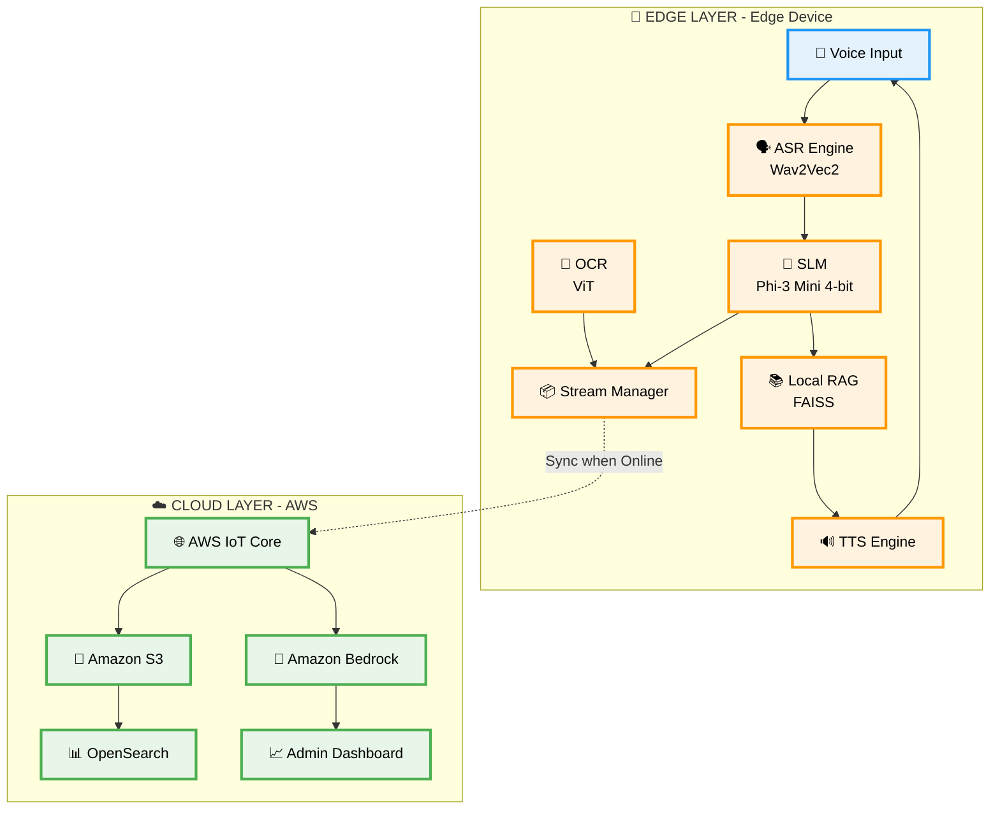
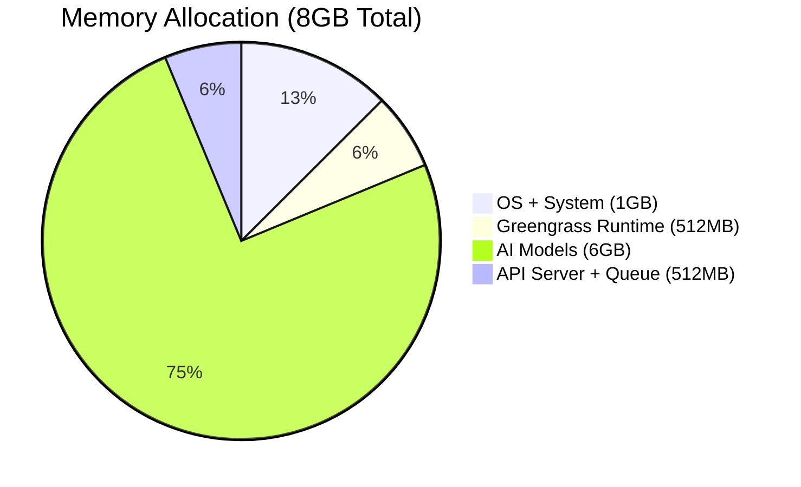
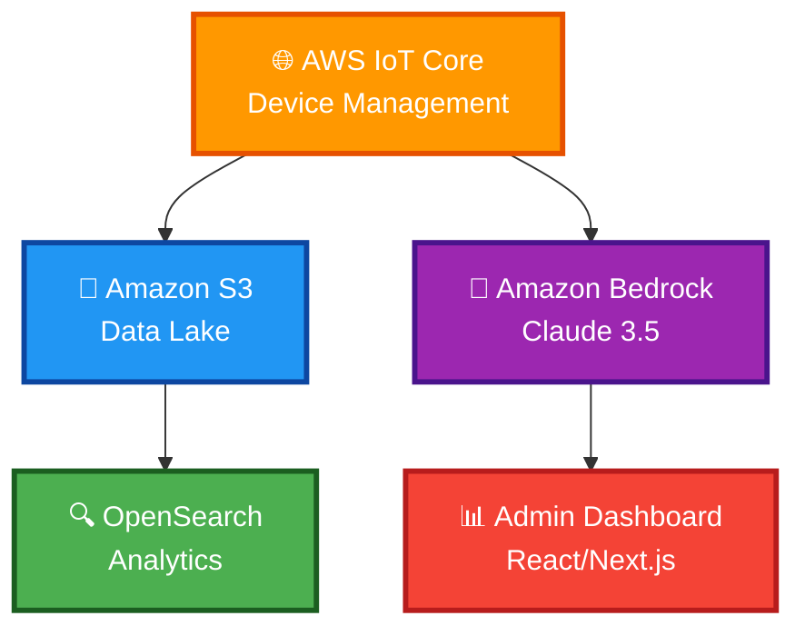
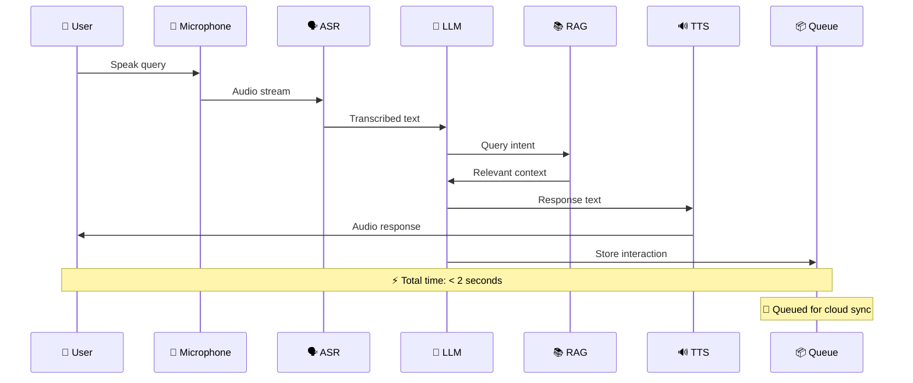
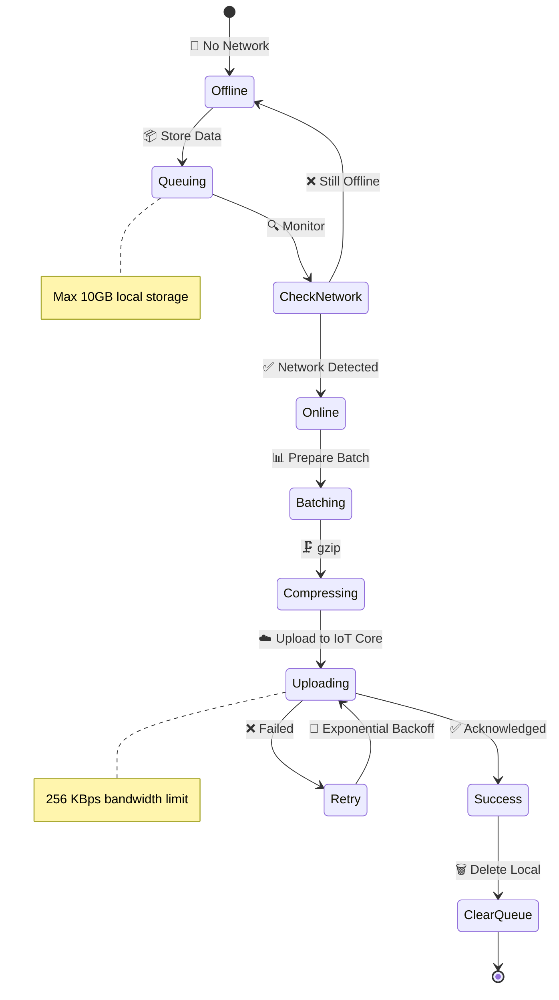
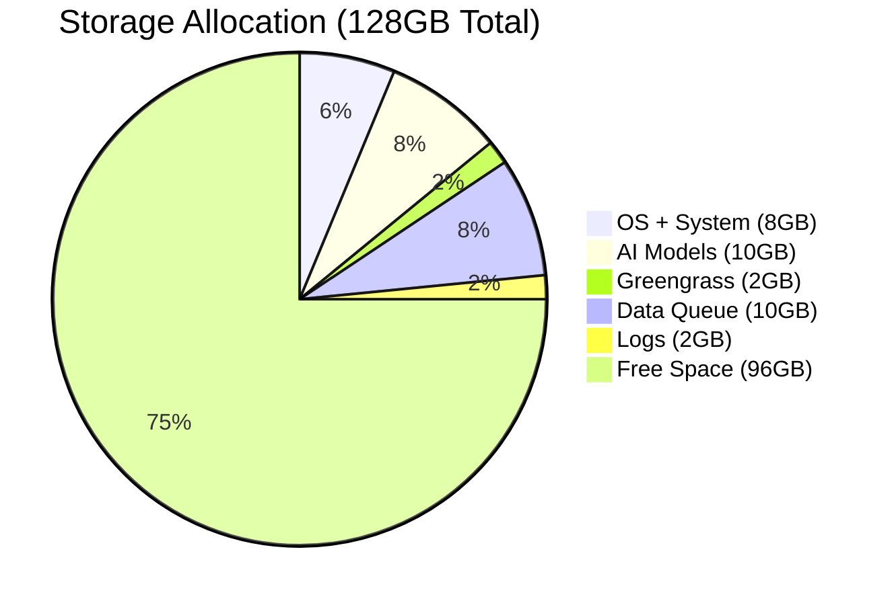

<div align="center">

# 📋 System Requirements Document

## Edge-Native AI for Civic Access

<p align="center">
  
</p>

[](https://github.com)
[](https://github.com)
[](https://github.com)
[](https://github.com)
[](https://github.com)

<br/>

**📅 Date:** February 15, 2026  
**🏷️ Classification:** Production-Grade National Deployment  
**🎯 Target Scale:** 250,000+ Panchayats across India

<br/>

```
╔══════════════════════════════════════════════════════════════╗
║  "Building the Digital Infrastructure for Rural India"      ║
╚══════════════════════════════════════════════════════════════╝
```

</div>

---

## 📑 Table of Contents

<table>
<tr>
<td width="50%">

**🏗️ Architecture & Design**

- [1️⃣ Project Overview](#1-project-overview)
- [2️⃣ System Architecture](#2-system-architecture-overview)
- [3️⃣ Edge Layer Requirements](#3-edge-layer-requirements)
- [4️⃣ AI Model Requirements](#4-ai-model-requirements)
- [5️⃣ Hardware Requirements](#5-hardware-requirements)

</td>
<td width="50%">

**☁️ Cloud & Operations**

- [6️⃣ Cloud Layer Requirements](#6-cloud-layer-requirements)
- [7️⃣ Data Flow Architecture](#7-data-flow-architecture)
- [8️⃣ Security & Privacy](#8-security--privacy-requirements)
- [9️⃣ Offline-First Constraints](#9-offline-first-constraints)
- [🔟 Scalability Strategy](#10-scalability-strategy)

</td>
</tr>
<tr>
<td width="50%">

**🚀 Deployment & Operations**

- [1️⃣1️⃣ DevOps & Deployment](#11-devops--deployment)
- [1️⃣2️⃣ Cost Optimization](#12-cost-optimization-strategy)

</td>
<td width="50%">

**🔮 Future & References**

- [1️⃣3️⃣ Future Enhancements](#13-future-enhancements)
- [📚 Appendix](#appendix-a-glossary)

</td>
</tr>
</table>

---

<div align="center">

## 1️⃣ Project Overview


</div>

### 1.1 Purpose 🎯

Deploy an **offline-first, edge-native AI assistant** to provide uninterrupted access to government civic services in **DDIL** (Disconnected, Degraded, Intermittent, Limited) environments across rural India.

<div align="center">

```
┏━━━━━━━━━━━━━━━━━━━━━━━━━━━━━━━━━━━━━━━━━━━━━━━━━━━━━━━━━━┓
┃  🎯 MISSION: Bridge the Digital Divide                    ┃
┃  🌍 VISION: Technology for Every Indian                   ┃
┃  💪 GOAL: 24/7 Uninterrupted Civic Access                 ┃
┗━━━━━━━━━━━━━━━━━━━━━━━━━━━━━━━━━━━━━━━━━━━━━━━━━━━━━━━━━━┛
```

</div>

### 1.2 Key Objectives 🌟

<table>
<tr>
<td align="center" width="33%">
<h3>🔌</h3>
<h4>Offline Operation</h4>
<p>100% functionality without internet connectivity</p>
</td>
<td align="center" width="33%">
<h3>🗣️</h3>
<h4>Voice-First Interface</h4>
<p>Support for Hindi and Bengali languages</p>
</td>
<td align="center" width="33%">
<h3>⚡</h3>
<h4>Instant Response</h4>
<p>less response time end-to-end latency for voice queries</p>
</td>
</tr>
<tr>
<td align="center" width="33%">
<h3>✍️</h3>
<h4>Handwriting OCR</h4>
<p>Digitize handwritten forms in multiple Indic scripts</p>
</td>
<td align="center" width="33%">
<h3>🔄</h3>
<h4>Smart Sync</h4>
<p>Automatic data upload when connectivity is restored</p>
</td>
<td align="center" width="33%">
<h3>💰</h3>
<h4>Cost Efficiency</h4>
<p>95% cost reduction vs cloud-native solutions</p>
</td>
</tr>
</table>

### 1.3 Target Users 👥

<div align="center">

|         User Type          | Count |    Primary Need    |
| :------------------------: | :---: | :----------------: |
|   🌾 **Rural Citizens**    | 50M+  | Scheme information |
|   👴 **Senior Citizens**   | 10M+  | Voice-first access |
| 🏛️ **Panchayat Officials** | 250K+ |  Service delivery  |
| 👷 **Daily Wage Workers**  | 20M+  |  Grievance filing  |

</div>

### 1.4 Use Cases 📋

<details>
<summary><b>🏛️ Government Scheme Eligibility</b> </summary>

<br/>

**Schemes Covered:**

- 📋 Lakshmir Bhandar (Women Welfare)
- 🌾 PM-KISAN (Agriculture)
- 🏥 Swasthya Sathi (Healthcare)
- 🏠 PM Awas Yojana (Housing)
- 🍚 Ration Card (Food Security)
- 👴 Old Age Pension

**Features:**

- ✅ Real-time eligibility checking
- 📊 Personalized recommendations
- 📝 Application guidance

</details>

<details>
<summary><b>📝 Grievance Registration</b> </summary>

<br/>

**Capabilities:**

- 🎤 Voice-based complaint filing
- 📸 Photo/video evidence upload
- 🔍 Status tracking
- 📧 Automatic escalation

</details>

<details>
<summary><b>✍️ Form Digitization</b> </summary>

<br/>

**Supported Forms:**

- 📋 Government application forms
- 🏥 Medical certificates
- 🏠 Property documents
- 📝 Handwritten grievances

</details>

---

<div align="center">

## 2️⃣ System Architecture Overview


</div>

### 2.1 Architecture Pattern 🎨

**Hybrid Edge-Cloud Architecture** with offline-first design principles.



### 2.2 Design Principles 📐

<div align="center">

|          Principle          |                  Description                  |
| :-------------------------: | :-------------------------------------------: |
|    🔌 **Offline-First**     | All critical operations work without internet |
|      🛡️ **Fail-Safe**       |   Graceful degradation when components fail   |
|   🔒 **Data Sovereignty**   |    Local data storage with encrypted sync     |
|     ⚡ **Low Latency**      |              Fast response time               |
| 💾 **Resource Constrained** |        Operate within hardware limits         |
|     🔄 **Maintainable**     |     Remote updates via AWS IoT Greengrass     |

</div>

---

<div align="center">

## 3️⃣ Edge Layer Requirements


</div>

### 3.1 AWS IoT Greengrass V2 ⚙️

<div align="center">

```
┌────────────────────────────────────────────────────────────┐
│  ⚙️ AWS IoT GREENGRASS V2: Edge Orchestration Platform    │
└────────────────────────────────────────────────────────────┘
```

</div>

#### 3.1.1 Core Requirements ✅

<table>
<tr>
<th>Requirement</th>
<th>Specification</th>
</tr>
<tr>
<td>📌 <b>Version</b></td>
<td>AWS IoT Greengrass V2 (latest stable)</td>
</tr>
<tr>
<td>🔌 <b>Deployment Mode</b></td>
<td>Standalone (no internet required)</td>
</tr>
<tr>
<td>🧩 <b>Architecture</b></td>
<td>Modular components for each AI service</td>
</tr>
<tr>
<td>💾 <b>Resource Management</b></td>
<td>CPU, memory, storage quotas per component</td>
</tr>
</table>

#### 3.1.2 Greengrass Components 🧩

<div align="center">

|      Component      |  Type  |         Purpose         |  RAM  | CPU |
| :-----------------: | :----: | :---------------------: | :---: | :-: |
|  🗣️ `asr-service`   | Custom |   Speech recognition    | 1.5GB |  1  |
|  🔊 `tts-service`   | Custom |     Text-to-speech      | 512MB | 0.5 |
|  🤖 `llm-service`   | Custom |  Phi-3 Mini inference   |  3GB  |  2  |
|  📸 `ocr-service`   | Custom | Handwriting recognition |  1GB  |  1  |
|  📚 `rag-service`   | Custom |   Knowledge retrieval   | 512MB | 0.5 |
|  🌐 `api-gateway`   | Custom |     FastAPI server      | 256MB | 0.5 |
| 📦 `stream-manager` |  AWS   |   Data queue and sync   | 512MB | 0.5 |

**Total Resources:** 7.3GB RAM, 6 CPU cores

</div>

#### 3.1.3 Stream Manager Configuration 📦

```yaml
StreamManager:
  MaxBandwidthKBps: 256 # 🌐 2G-friendly bandwidth
  MinSizeBytes: 1048576 # 📦 1MB minimum batch
  MaxStreamSize: 10737418240 # 💾 10GB local queue
  StrategyOnFull: RejectNewData # 🚫 Reject when full
  ExportDefinitions:
    - Identifier: "civic-data-export"
      Destination: "IoTAnalytics"
      Priority: 10 # 🔝 High priority
      BatchSize: 100 # 📊 100 records/batch
```

### 3.2 ONNX Runtime 🚀

<div align="center">


</div>

#### 3.2.1 Core Requirements

<table>
<tr>
<td width="50%">

**📌 Specifications**

- **Version:** ≥ 1.17.0
- **Provider:** CPUExecutionProvider (ARM64)
- **Quantization:** INT8, INT4 support
- **Threading:** OpenMP (4 threads max)
- **Memory:** Arena-based (2GB limit)

</td>
<td width="50%">

**⚡ Performance Targets**

- 
- 
- 
- 

</td>
</tr>
</table>

### 3.3 Quantized Phi-3 Mini (Small Language Model) 🤖

<div align="center">


</div>

#### 3.3.1 Model Specifications 📊

<table>
<tr>
<th>Attribute</th>
<th>Value</th>
<th>Badge</th>
</tr>
<tr>
<td>🏷️ <b>Base Model</b></td>
<td>Microsoft Phi-3 Mini</td>
<td></td>
</tr>
<tr>
<td>🗜️ <b>Quantization</b></td>
<td>4-bit GPTQ or AWQ</td>
<td></td>
</tr>
<tr>
<td>💾 <b>Model Size</b></td>
<td>≤ 2.5GB on disk</td>
<td></td>
</tr>
<tr>
<td>📏 <b>Context Length</b></td>
<td>4096 tokens</td>
<td></td>
</tr>
<tr>
<td>⚡ <b>Latency</b></td>
<td>< 500ms (100 tokens)</td>
<td></td>
</tr>
<tr>
<td>🎯 <b>Intent Accuracy</b></td>
<td>≥ 98%</td>
<td></td>
</tr>
</table>

#### 3.3.2 Fine-tuning Requirements 🎓

<div align="center">

```
┏━━━━━━━━━━━━━━━━━━━━━━━━━━━━━━━━━━━━━━━━━━━━━━━━━━━━━━━━━━┓
┃  📚 TRAINING DATA REQUIREMENTS                             ┃
┣━━━━━━━━━━━━━━━━━━━━━━━━━━━━━━━━━━━━━━━━━━━━━━━━━━━━━━━━━━┫
┃  📋 50,000+ scheme descriptions                            ┃
┃  ❓ 100,000+ Q&A pairs for common queries                  ┃
┃  ✅ 10,000+ eligibility rules                              ┃
┃  🌍 Hindi, Bengali, and English                            ┃
┗━━━━━━━━━━━━━━━━━━━━━━━━━━━━━━━━━━━━━━━━━━━━━━━━━━━━━━━━━━┛
```

</div>

### 3.4 Offline TTS (Text-to-Speech) 🔊

<div align="center">


</div>

#### 3.4.1 Performance Specifications

<table>
<tr>
<td align="center" width="25%">
<h3>⚡</h3>
<h4>Latency</h4>

</td>
<td align="center" width="25%">
<h3>💾</h3>
<h4>Memory</h4>

</td>
<td align="center" width="25%">
<h3>🎵</h3>
<h4>Quality</h4>

</td>
<td align="center" width="25%">
<h3>🚀</h3>
<h4>RTF</h4>

</td>
</tr>
</table>

### 3.5 ViT-based OCR for Handwritten Indic Scripts 📸

<div align="center">


</div>

#### 3.5.1 Supported Scripts 📝

<div align="center">

|     Script     | Training Data | CER  |  WER  |
| :------------: | :-----------: | :--: | :---: |
|  🔤 **Hindi**  | 100K+ images  | < 8% | < 12% |
| 🔤 **Bengali** | 100K+ images  | < 8% | < 12% |

</div>

#### 3.5.2 OCR Pipeline 🔄

```mermaid
graph LR
    A[📸 Image Capture] --> B[🔧 Preprocessing]
    B --> C[🔍 Text Detection]
    C --> D[🤖 Text Recognition]
    D --> E[✅ Post-processing]
    E --> F[📋 Structured JSON]

    style A fill:#E3F2FD,stroke:#2196F3,stroke-width:2px,color:#000
    style B fill:#FFF3E0,stroke:#FF9800,stroke-width:2px,color:#000
    style C fill:#F3E5F5,stroke:#9C27B0,stroke-width:2px,color:#000
    style D fill:#E8F5E9,stroke:#4CAF50,stroke-width:2px,color:#000
    style E fill:#FFF9C4,stroke:#FBC02D,stroke-width:2px,color:#000
    style F fill:#FFEBEE,stroke:#F44336,stroke-width:2px,color:#000
```



### 3.6 Local RAG (Retrieval-Augmented Generation) 📚

<div align="center">


</div>

#### 3.6.1 Knowledge Base Coverage 📖

<table>
<tr>
<td align="center" width="33%">
<h3>📋</h3>
<h4>Government Schemes</h4>

<p>Complete scheme descriptions</p>
</td>
<td align="center" width="33%">
<h3>❓</h3>
<h4>FAQs</h4>

<p>Common Q&A pairs</p>
</td>
<td align="center" width="33%">
<h3>✅</h3>
<h4>Eligibility Rules</h4>

<p>Criteria and conditions</p>
</td>
</tr>
</table>

---

<div align="center">

## 4️⃣ AI Model Requirements


</div>

### 4.1 Model Inventory 📦

<div align="center">

|            Model            |   Purpose   | Disk  |  RAM  | Quantization | Latency |
| :-------------------------: | :---------: | :---: | :---: | :----------: | :-----: |
|      🤖 **Phi-3 Mini**      | Intent & QA | 2.5GB |  3GB  |  4-bit GPTQ  | < 500ms |
|   🗣️ **Wav2Vec2 (Hindi)**   |     ASR     | 1.2GB | 1.5GB |     INT8     |  < 1s   |
|  🗣️ **Wav2Vec2 (Bengali)**  |     ASR     | 1.2GB | 1.5GB |     INT8     |  < 1s   |
|  🔊 **Piper TTS (Hindi)**   |     TTS     | 400MB | 512MB |      -       | < 500ms |
| 🔊 **Piper TTS (Bengali)**  |     TTS     | 400MB | 512MB |      -       | < 500ms |
|  📸 **ViT OCR (Bengali)**   |     OCR     | 800MB |  1GB  |     INT8     |  < 2s   |
| 🔍 **Sentence Transformer** | Embeddings  | 200MB | 256MB |      -       | < 100ms |

**📊 Total:** ~8GB Disk, ~9GB RAM (peak)

</div>

### 4.2 Memory Budget 💾



<div align="center">


</div>

---

<div align="center">

## 5️⃣ Hardware Requirements


</div>

### 5.1 Edge Device Options 🖥️

#### Option 1: Raspberry Pi 5 🍓

<table>
<tr>
<td width="50%">

**📌 Core Specifications**

- **Model:** Raspberry Pi 5 (8GB)
- **CPU:** Quad-core ARM Cortex-A76 @ 2.4GHz
- **RAM:** 8GB LPDDR4X-4267
- **Storage:** 128GB microSD (UHS-I)
- **Power:** 5V/5A USB-C (27W)


</td>
<td width="50%">

**🔌 Connectivity**

- Wi-Fi 802.11ac (2.4/5GHz)
- Bluetooth 5.0
- Gigabit Ethernet
- 4G LTE (USB dongle)


</td>
</tr>
</table>

#### Option 2: Industrial PC 🖥️

<table>
<tr>
<td width="50%">

**📌 Core Specifications**

- **Model:** Industrial Mini PC
- **CPU:** Intel Core i5 or equivalent
- **RAM:** 8GB DDR4
- **Storage:** 128GB SSD
- **Power:** 12V DC (40-60W)


</td>
<td width="50%">

**🔌 Connectivity**

- Wi-Fi 802.11ac (2.4/5GHz)
- Bluetooth 5.0
- Gigabit Ethernet
- 4G LTE (USB dongle)


</td>
</tr>
</table>

### 5.2 Peripherals 🎤📸🔊

<div align="center">

|       Device       |        Specification         |   Purpose    |
| :----------------: | :--------------------------: | :----------: |
| 🎤 **Microphone**  |  USB, 50Hz-16kHz, SNR ≥60dB  | Voice input  |
|   🔊 **Speaker**   | USB/3.5mm, ≥5W RMS, 85dB SPL | Audio output |
|   📸 **Camera**    |  ≥5MP, Auto-focus, USB/CSI   | OCR capture  |
|     🔋 **UPS**     |    12V DC, 2-hour backup     | Power backup |
| ☀️ **Solar Panel** |   50W + charge controller    | Remote power |

</div>

---

<div align="center">

## 6️⃣ Cloud Layer Requirements


</div>

### 6.1 AWS Services Stack 🏗️



### 6.2 Service Specifications 📋

<div align="center">

|        Service        |      Purpose      |    Scale     | Cost/Month |
| :-------------------: | :---------------: | :----------: | :--------: |
|  🌐 **AWS IoT Core**  | Device management | 250K devices |  $25,000   |
|   💾 **Amazon S3**    |   Data storage    |     25PB     |  $500,000  |
| 🧠 **Amazon Bedrock** |    Advanced AI    | 1M requests  |  $10,000   |
|   🔍 **OpenSearch**   |     Analytics     |    100TB     |  $50,000   |
| 📊 **Data Transfer**  |  Network egress   |     10TB     |  $100,000  |

**💰 Total Cloud Cost:** $685,000/month for 250K devices

</div>

### 6.3 Amazon Bedrock Configuration 🧠

<div align="center">


</div>

#### 6.3.1 Guardrails Configuration 🛡️

<table>
<tr>
<td align="center" width="25%">
<h3>🚫</h3>
<h4>Hate Speech</h4>

</td>
<td align="center" width="25%">
<h3>⚠️</h3>
<h4>Violence</h4>

</td>
<td align="center" width="25%">
<h3>🔒</h3>
<h4>PII</h4>

</td>
<td align="center" width="25%">
<h3>📝</h3>
<h4>Profanity</h4>

</td>
</tr>
</table>

---

<div align="center">

## 7️⃣ Data Flow Architecture


</div>

### 7.1 Voice Query Flow (Offline) 🗣️



### 7.2 Sync Flow (Online) ☁️



---

<div align="center">

## 8️⃣ Security & Privacy Requirements


</div>

### 8.1 Compliance Framework 📜

<div align="center">

|      Regulation      |                 Measures                  |
| :------------------: | :---------------------------------------: |
| 🇮🇳 **DPDP Act 2023** | PII minimization, consent, data retention |
|  🆔 **Aadhaar Act**  |      No storage, only masked display      |
|  💻 **IT Act 2000**  |      Secure transmission, encryption      |

</div>

### 8.2 Security Layers 🛡️

<table>
<tr>
<td align="center" width="33%">
<h3>📱</h3>
<h4>Edge Security</h4>

<p>• Minimal Linux OS<br/>• Sandboxed components<br/>• Code signing (GPG)<br/>• Disk encryption (LUKS)</p>
</td>
<td align="center" width="33%">
<h3>🌐</h3>
<h4>Network Security</h4>

<p>• X.509 certificates<br/>• MQTT over TLS<br/>• VPC isolation<br/>• AWS WAF</p>
</td>
<td align="center" width="33%">
<h3>💾</h3>
<h4>Data Security</h4>

<p>• S3 SSE encryption<br/>• AWS KMS keys<br/>• PII redaction<br/>• Audit logging</p>
</td>
</tr>
</table>

---

<div align="center">

## 9️⃣ Offline-First Constraints


</div>

### 9.1 Core Principles 📐

<div align="center">

```
┏━━━━━━━━━━━━━━━━━━━━━━━━━━━━━━━━━━━━━━━━━━━━━━━━━━━━━━━━━━┓
┃  🎯 OFFLINE-FIRST DESIGN PRINCIPLES                        ┃
┣━━━━━━━━━━━━━━━━━━━━━━━━━━━━━━━━━━━━━━━━━━━━━━━━━━━━━━━━━━┫
┃  ✅ Zero Internet Dependency for Core Functions            ┃
┃  ✅ Graceful Degradation (Cloud features optional)         ┃
┃  ✅ Local-First Data Storage                               ┃
┃  ✅ Eventual Consistency (Sync when possible)              ┃
┃  ✅ Idempotent Operations                                  ┃
┗━━━━━━━━━━━━━━━━━━━━━━━━━━━━━━━━━━━━━━━━━━━━━━━━━━━━━━━━━━┛
```

</div>

### 9.2 Storage Budget 💾



---

<div align="center">

## 🔟 Scalability Strategy


</div>

### 10.1 Deployment Roadmap 🗺️

<div align="center">

|     Phase      | Timeline  |  Kiosks  | Citizens |
| :------------: | :-------: | :------: | :------: |
| 🎯 **Phase 1** | 3 months  |   100    |   50K    |
| 🚀 **Phase 2** | 6 months  |  1,000   |   500K   |
| 📈 **Phase 3** | 12 months |  10,000  |    5M    |
| 🌍 **Phase 4** | 24 months | 250,000+ |   50M+   |

</div>

### 10.2 Cost Projections 💰

<div align="center">


</div>

---

<div align="center">

## 1️⃣1️⃣ DevOps & Deployment


</div>

### 11.1 CI/CD Pipeline 🔄


### 11.2 Monitoring & Alerts 📊

<div align="center">

|   Alert Type    |      Threshold      |   Action    |                                   Priority                                    |
| :-------------: | :-----------------: | :---------: | :---------------------------------------------------------------------------: |
| 🔴 **Critical** | Device offline > 1h | SMS + Email |   |
| 🟠 **Warning**  |      CPU > 90%      |    Email    |    |
|   🟡 **Info**   |    Daily summary    |  Dashboard  |  |

</div>

---

<div align="center">

## 1️⃣2️⃣ Cost Optimization Strategy


</div>

### 12.1 Optimization Strategies 💡

<table>
<tr>
<td align="center" width="33%">
<h3>📱</h3>
<h4>Edge Optimization</h4>

<p>• Bulk procurement<br/>• Local manufacturing<br/>• Solar power<br/>• Refurbishment</p>
</td>
<td align="center" width="33%">
<h3>☁️</h3>
<h4>Cloud Optimization</h4>

<p>• Data compression<br/>• Lifecycle policies<br/>• Reserved instances<br/>• Prompt caching</p>
</td>
<td align="center" width="33%">
<h3>🔋</h3>
<h4>Power Optimization</h4>

<p>• Solar panels<br/>• CPU throttling<br/>• Model unloading<br/>• Scheduled shutdown</p>
</td>
</tr>
</table>

---

<div align="center">

## 1️⃣3️⃣ Future Enhancements


</div>

### 13.1 Roadmap 🗺️

<div align="center">

|      Timeline      |               Enhancement                |                                      Impact                                       |
| :----------------: | :--------------------------------------: | :-------------------------------------------------------------------------------: |
| 📅 **6-12 months** | Multimodal interaction (video, gestures) |       |
|  📅 **1-2 years**  |      Federated learning, blockchain      |  |
|  📅 **2-5 years**  |  AI recommendations, edge-to-edge mesh   |       |

</div>

---

<div align="center">

## 📚 Appendix A: Glossary


</div>

<table>
<tr>
<th>Term</th>
<th>Definition</th>
<th>Category</th>
</tr>
<tr>
<td>🗣️ <b>ASR</b></td>
<td>Automatic Speech Recognition</td>
<td></td>
</tr>
<tr>
<td>🌐 <b>DDIL</b></td>
<td>Disconnected, Degraded, Intermittent, Limited</td>
<td></td>
</tr>
<tr>
<td>📚 <b>RAG</b></td>
<td>Retrieval-Augmented Generation</td>
<td></td>
</tr>
<tr>
<td>🚀 <b>ONNX</b></td>
<td>Open Neural Network Exchange</td>
<td></td>
</tr>
<tr>
<td>🔄 <b>OTA</b></td>
<td>Over-The-Air (remote updates)</td>
<td></td>
</tr>
</table>

---

<div align="center">

## 📋 Document Control


<br/><br/>

**© 2026 Bit Verse | Production-Grade Requirements**

<br/>

```
┌─────────────────────────────────────────────────────────────┐
│  "Building the future of civic technology, one kiosk at a  │
│   time, ensuring no Indian is left behind in the digital   │
│   revolution."                                              │
└─────────────────────────────────────────────────────────────┘
```

<br/>


</div>
